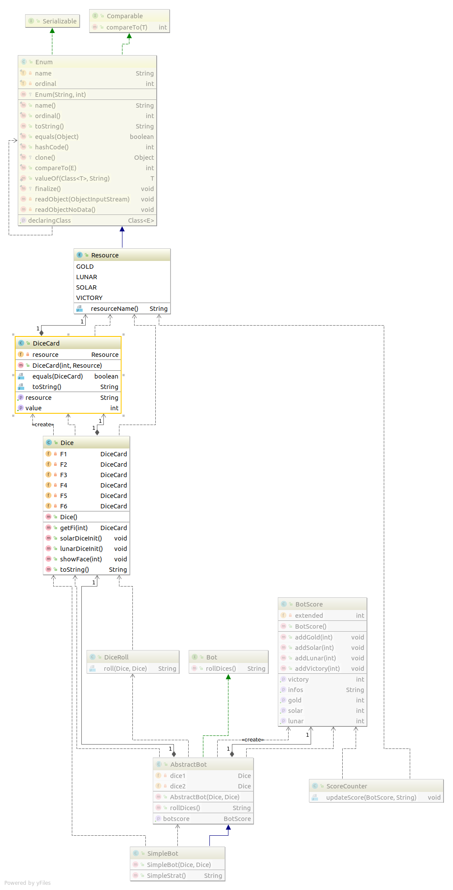
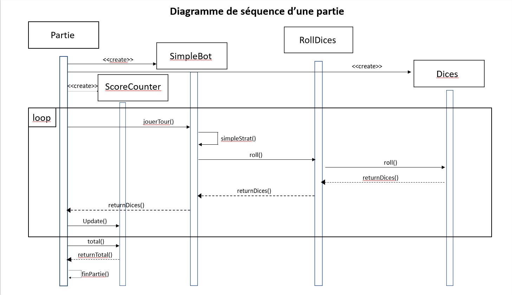
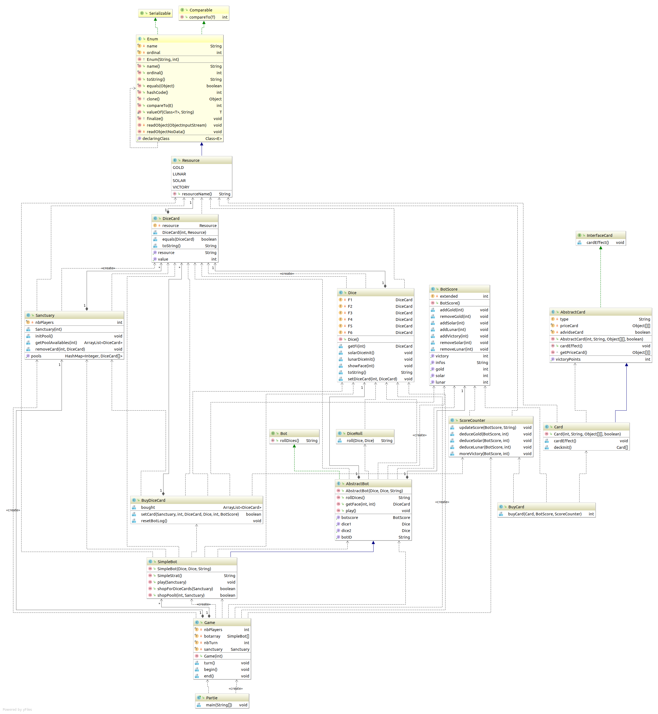
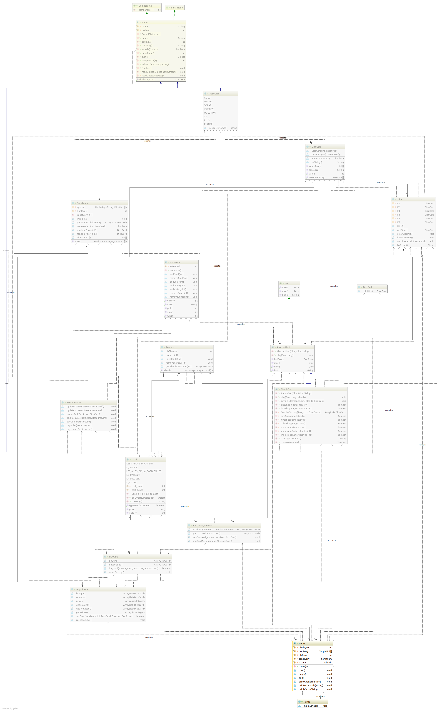

# Dice-Forge
Groupe DFG

* Nicolas Zimmer
* Remy Munier
* Erdal Toprak
* Alexandre Denos
* Maxime Samak

## [Milestones](https://github.com/SamakM/Dice-Forge/milestones?direction=asc&sort=due_date&state=open)

### [Livraison 1](https://github.com/SamakM/Dice-Forge/milestone/1)
#### Objectif de livraison
- [x] Gestion de début et de fin de parties.
- [x] Ajout des Dés sans faces permutables.
- [x] Ajout d'un joueur(bot) capable de lancer deux dés (stratégie basique).
- [x] Ajout d'un compteur de points qui actualise le score.
- [x] Ajout des tests associés aux tâches précédentes.

#### Date prévu
*26/10/2018*

### [Livraison 2](https://github.com/SamakM/Dice-Forge/milestone/2)
#### Objectif de livraison
- [x] Interchangeabilité des faces d'un dé.
- [x] Ajout d'un second joueur(bot) au jeu.
- [x] Affinage de la stratégie d'un bot(choix des faces).
- [x] Gestion du déroulement des tours de jeu, sélection du gagnant.
- [ ] ~~Ajout d'achat de cartes (les cartes n'ont aucun effet elles représentent simplement un gain de points).~~
- [x] Ajout de nouveaux tests.
- [x] Optimisation et améliorations du code.

#### Date prévu
*9/11/2018*

### [Livraison 3](https://github.com/SamakM/Dice-Forge/milestone/3)
#### Objectif de livraison
- [X] Ajout d'achat de cartes (les cartes n'ont aucun effet elles représentent simplement un gain de points).
- [ ] ~~Ajout des cartes qui réalise une action en plus jusqu'à la fin et pour un seul tour.~~
- [X] Ajout des faces de dé ayant un effet "complexe".
- [X] Ajout de nouveaux tests.
- [X] Optimisation et améliorations du code.

#### Date prévu
*16/11/2018*

### [Livraison 3.5](https://github.com/SamakM/Dice-Forge/milestone/7)
#### Objectif de livraison
- [x] Modification de ScoreCounter en fonction du nouveau DiceRoll 
- [x] Modification de l'affichage produit par Game
- [x] Modification des test en relation avec DiceRoll
- [x] Modification de la classe DiceRoll

### [Livraison 4](https://github.com/SamakM/Dice-Forge/milestone/4)
#### Objectif de livraison
- [ ] ~~Ajout des cartes qui réalise une action en plus jusqu'à la fin et pour un seul tour.~~
- [x] Finalisation des dés(ajout des deux dernières face de dé apporté par les effets de carte).
- [ ] ~~Ajout de tous les effets de carte(gain de point, changement de face de dé).~~
- [x] Optimisation du bot(stratégie carte, face de dé).
- [x] Ajout de nouveaux tests.
- [x] Optimisation et améliorations du code.

#### Date prévu
*30/11/2018*

### [Livraison 5](https://github.com/SamakM/Dice-Forge/milestone/5)
#### Objectif de livraison
- [ ] Ajout de tous les effets de cartes.
- [ ] Le joueur éxécute l'effet d'une carte.
- [ ] Optimisation et améliorations du code. 
- [ ] Ajout de nouveaux tests.
- [ ] Les deux bots appliquent des "stratégies" différentes.
- [ ] Ajout des stratégies sur les cartes.

#### Date prévu
*07/12/2018*

### [Livraison 6](https://github.com/SamakM/Dice-Forge/milestone/6)
#### Objectif de livraison
- [ ] Correction d'éventuels bugs.
- [ ] Il possible de sélectionner la stratégie qu'applique un bot donné.
- [ ] Ajout d'une nouvelle stratégie de jeu pour les bots.
- [ ] Finalisation de la documentation.
- [ ] Ajout des ilots et des pions.

#### Date prévu
*14/12/2018*

## Note

* [Lien rapide vers le Kanban](https://github.com/SamakM/Dice-Forge/projects/2)
* Un nouveau diagramme UML est produit à chaque livraison.
* Les nouveaux tests correspondent toujours aux derniers éléments implémentés dans le jeu.

## Diagrammes UML

* Livraison 1:
  
  
* Livraison 2:
  
  
* Livraison 3:
  
* Livraison 3.5:
  
* Livraison 4:
  
* Livraison 5:
* Livraison 6:
